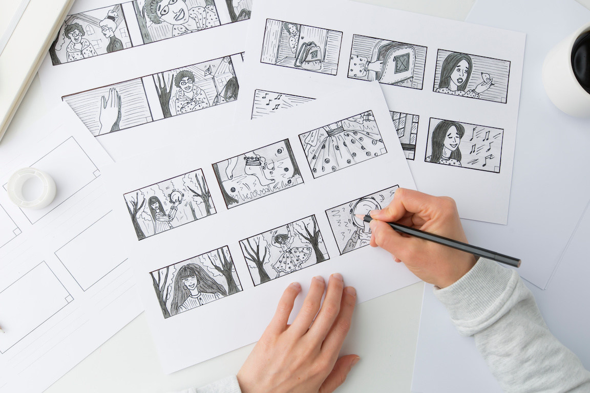

## Step 4: Build a storyboard for the proposed digital experience application (15 min)

In this step, you will build the storyboard for your application. Please download the storyboard template from here: [https://museumsvictoria.com.au/media/6716/making-history-storyboard-tempate.pdf](https://museumsvictoria.com.au/media/6716/making-history-storyboard-tempate.pdf)

{alt="hands"}

Here, you will have to think about your context, user and project plan as you set it up in previous steps and start creating a storyboard. A storyboard can be perceived as a graphic organisation of the scenes/sequence of the proposed application in terms of visually organising our media and access to information. The storyboard's purpose is to outline access/initiation of the application and walk through it in terms of the information/multimedia that will be included.

Now look at the examples below:

-	Chaudhsry, A. (2022). Case Study: Virtual art gallery tour app. Retrieved from: [https://bootcamp.uxdesign.cc/case-study-virtual-art-gallery-tour-app-615150c81978](https://bootcamp.uxdesign.cc/case-study-virtual-art-gallery-tour-app-615150c81978)
-	Ng, C. (2019). Connecting Solo Museum Visitors. Retrieved from: [https://chloenhy.github.io/museum-visitors/](https://chloenhy.github.io/museum-visitors/)

Think of the following information to include in your storyboard:

-	How will the user access the application?
-	What will be the starting screen/scene of the application?
-	How will the user access the next/following scenes and how they will access information?
-	What are the media to include (images, videos, texts, 3D models, audio etc)?
-	What will be the closing scene?

In the storyboard template, the **first box** of the storyboard will be used to sketch what is happening in each scene.  The **action box** is dedicated to the description of what is happening in each scene. In the **narration/caption box**, you can fill in a phrase/message/blurb as it will appear to the user and lastly, the **music/sound effect box** can provide some information about the sound/s which accompany the information provided on each scene/screen (if present).

The most important thing to remember when designing a storyboard is to be creative, work as a team and produce/test many drafts which can help you to decide about the final visual organisation of the proposed application.
