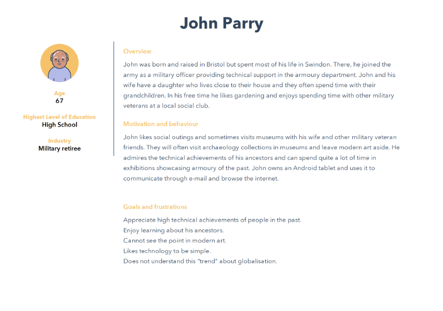
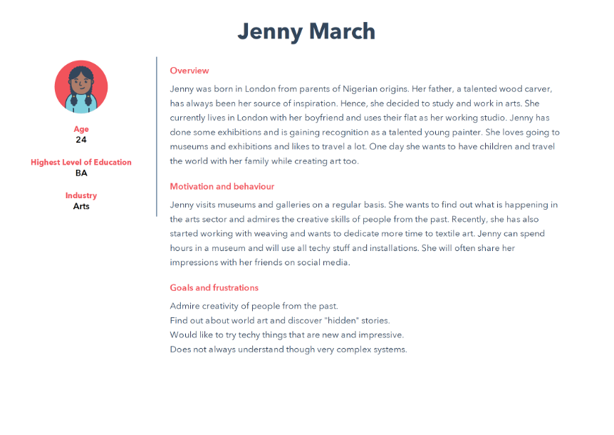

## Step 2: Choose your user through the persona building method (15 min)

First, download the [Persona builder template](files/persona-digital-experience.pdf)

In this step you will use the persona building method, which is established in User Experience (UX) design to define key characteristics of the user of your application.

Please bear in mind that we are interested in personas within the arts/heritage digital interpretative experience context. Hence key points we are interested in are:

-	Information about our persona in terms of age, occupation, family status, location (where this person lives), electronic devices they use.
-	Experience in internet/pc, mobile/table, social media use.
-	Quote, i.e., a phrase that exemplifies this persona’s attitudes and might include some information with regards to digital interpretative experiences, use of technology, personal interests etc. For instance:

>I would like to discover hidden stories about the museum’s collections. 

>I like geography and video games. I wish museums were more relevant to my interests.

-	A summary of our persona's background, life priorities, motivations to enjoy (or not) art and heritage, visiting styles and more. An example of a summary could be:

*Sarah is 23 years old and is working as a hotel manager in central London. Sarah shares a flat in Brixton with her friend Martha. She grew up in Folkestone and studied Business and Tourism in London. She loves the capital’s vibrant atmosphere and enjoys visiting photography exhibitions and art museums with friends every couple of weeks. Sarah loves taking photographs with her mobile phone and is keen to expand her knowledge to photography soon.*

- Digital exhibition/experience goals, i.e., reflecting on goals and expectations of the persona with regards to the proposed application. For instance: 

>To easily access information within limited visiting time.

>To entertain my children in the museum and spark their interest.

- Digital exhibition/experience frustrations, i.e., thinking about the aspects that would frustrate your persona and prevent them from enjoying the proposed application. For instance:

> I don’t like reading long texts in museum apps. 

>I don’t want to follow a predefined path when visiting a museum, I want to see the things that are closer to my interests.

Some examples to help you through the persona design process are the following:

{alt="user 1"}

{alt="user 2"}

- Sun, C. (2020-2023). Muse project. Retrieved from: [https://www.clairsun.design/work/muse-discovery-art](https://www.clairsun.design/work/muse-discovery-art)
-	Roussou, M., Katifori, A., Pujol, L., Vayanou, M., & Egglestone, S.R. (2013). A life of their own: museum visitor personas penetrating the design lifecycle of a mobile experience. CHI '13 Extended Abstracts on Human Factors in Computing Systems. Retrieved from: [https://www.semanticscholar.org/paper/A-life-of-their-own%3A-museum-visitor-personas-the-of-Roussou-Katifori/6a2bbf76860bd579151b0efbfd004cb5358aa06a](https://www.semanticscholar.org/paper/A-life-of-their-own%3A-museum-visitor-personas-the-of-Roussou-Katifori/6a2bbf76860bd579151b0efbfd004cb5358aa06a)

