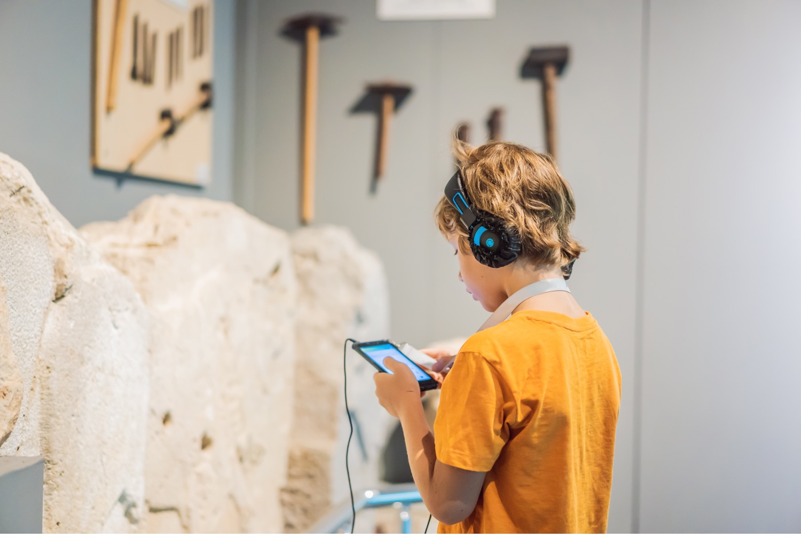

This resource provides guidance on digital practices to curate interactive experiences through a set of practical exercises. The resource aims to support GLAM’s researchers and practitioners to engage with their audiences through the design of multimedia applications, while making use of appropriate frameworks and tools.

{alt="boy in museum"}

By the end of this session you are expected to be able to:

- Manage a digital exhibition/experience project.
- Define users or target audiences through UX and visitor research methods.
- Design a storyboard for a multimedia interpretative application.
