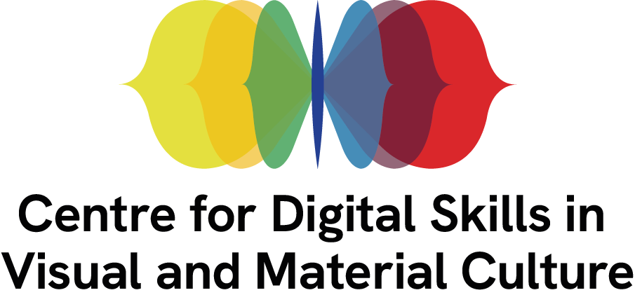

## Setup
During the tutorial we will use established methods and frameworks to practice how to manage a digital exhibition/experience design project from the stage of its conception to the stage of its conceptualisation through a storyboard. 

For these, you will need to access to one of the following resources: 

- [Persona builder template](files/persona-digital-experience.pdf) or [Hubspot - Make my persona tool](https://www.hubspot.com/make-my-persona) or [Canva persona template](https://www.canva.com/p/templates/EAFupsPXUJ4-beige-and-orange-professional-marketing-buyer-persona-a4-document/) (you will need to create an account).
- [Project canvas template](files/project-canvas.pdf) or [Miro editable template](https://miro.com/templates/project-canvas-2/) (you will need to create an account) 
- [Storyboard building template](https://museumsvictoria.com.au/media/6716/making-history-storyboard-tempate.pdf) or [Miro editable template](https://miro.com/miroverse/storyboarding-toolkit/) (you will need to create an account).

The resource is built with [The Carpentries Workbench](https://carpentries.github.io/sandpaper-docs/), as part of the training activities of the [AHRC-funded network service on Digital Skills in Visual and Material Culture](https://www.culturedigitalskills.org). 

{width=50% alt="logo"}

